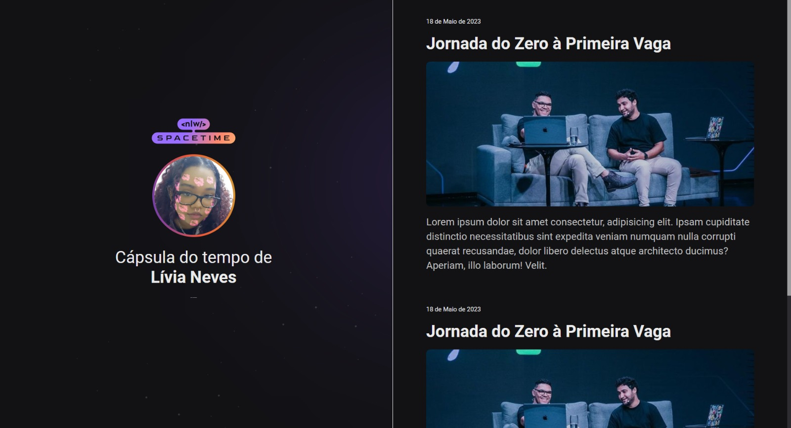

NLW Spacetime (Evento da Rocketseat)

Projeto desenvolvido durante o evento NLW Spacetime da Rocketseat. Ele consiste em uma página web responsiva construida com HTML e CSS. 

Recursos do projeto: 
- Página web responsiva com layout de duas colunas.
- Aplicação de animações e transições utilizando CSS.

O objetivo do projeto é construir uma "Cápsula do tempo" onde o usuário possa adicionar imagens, textos e links. 
